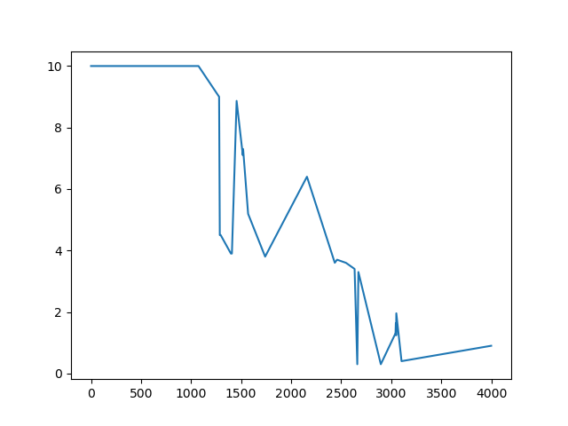

# Overview
This repo is a collection of tools to use computer vision to estimate the moisture value of soil using images of soil with different spectrum lasers shining on the soil. Frames are recorded, matched to moisture values through different methods, and then trained in YOLOv5 (a copy of which is included) after labeling.

# Requirements
- Python OpenCV2
- PyTorch

# Recording

## Manual Recording (Recording/record_manual.py)
Manual recording lets you enter the moisture, which saves it as well as an image at that instant to a .csv and .jpg respectively:

	python record_manual.py
	
## Semi-Automatic Recording (Recording/record_semi_automatic.py)
Press enter during the run to take an image. Gives you more control over when you take photos after/during watering. The automatic part refers to the fact that the moistures are recorded from the .csv when using our moisture sensor:

	python record_semi_automatic.py

## Automatic Recording (Automatic/record_automatic.py)
Records a frame every second, press q to end recording. Is paired with the .csv from our moisture sensor:

	python record_automatic.py

# Post-Processing/Combining
## Regular
Now that you have a recording, you need to combine the images and moisture values.
This can be done with:
	
	consolidate.py <recording_folder_name> <output_folder>
	
In the post-processing folder. This method is for manual recordings where you enter in the moisture.

## Semi Automatic
Pairs every frame with the respective .csv entry. Uses calibration to convert to moimsture values from 0-10:

	consolidate.py <csv_file> <recording_folder_name> <column> <output_folder>

## Automatic

The below method is in the Automatic folder. It uses our custom moisture reader's csv file values, and uses calibration to convert it to the moisture values 0-10. MUST RUN THE SCRIPT IN THE SAME DIRECTORY. To run:

	consolidate_automatic.py <csv_file> <recording_folder_name> <column> <output_folder>
	
### Example:
python consolidate_automatic.py ~/Irrigationai/Data/recording6/2-24-2024_10-13-14.csv ~/Irrigationai/Data/recording6/ 5 ~/Downloads/recording6

# Training

YOLOv5 is in the YOLO folder. It contains a readme with instructions on how to use. Here is a snippet of running the training code:

	python train.py --img 640 --epochs 1000 --data data/moisturev4.yaml --weights yolov5s.pt --hyp data/hyps/hyp.scratch-med.yaml

The output data after training is stored in YOLO/runs/trains/.

The runs folder contain training results, and example predictions.

### Data

Data is stored in YOLO/data. A dataset needs a .yaml file in this directory, which links to a folder with its images and classes. For example, moisturev4.yaml links to the folder YOLO/moisturev4, a dataset with 351 images.

### Hyperparameters

Hyperparameters are stored in YOLO/data/hyps. They are .yaml files with arguments that can be edited, for instance: lr0 is initial learning rate, and lrf is the final learning rate. You can specify a .yaml file for hyperparameters with the --hyp argument.

# Calibration

Our custom moisture sensor uses values in the thousands, and they are inversely related to the standard moisture reading of 0-10. calibration.py allows conversion of our moisture to the standard values. By default, this repo comes with two calibration csv files, but using the scripts in Calibration/ you are able to make your own:

### Recording calibration

Make sure the SD card is reading from our moisture sensor. Then simply run record calibration and manually input what the moisture of the soil is at that moment (using a commercial sensor in the 0-10 range). This will save a recording.csv file that will be used later.

### Making calibration

Now that you have made a recording, you will need to the .csv file from the SD card. Then you must run the make_calibration.py:

	make_calibration.py <csv_file> <column>
	
With <csv_file> being the directory to the SD card .csv file, and column being the number of the sensor to read from. For example:

	python make_calibration.py 4-9-2024_14-15-59.csv 5
	
After running, a file called calibration.csv will be made. This is the file that is used to convert our moisture to the commercial sensor moisture.

IMPORTANT NOTE!
Even after trying to correct the time on both computers, the times may be off for each recording. For example, the recording.csv and the SD card .csv may have an entry made at the same time, but the timestamp may be hours off.
By default, make_calibration.py has a variable called timeOffset, and it is set by default to 18032 seconds. If the time offset is fixed, you can set this to zero in the script.

### Testing

Once the calibration.csv is generated, you can run show_graph.py to display a graph of the calibration:

While this calibration isn't the best, you can see how our sensor and the commercial sensor are inversely proportional.
